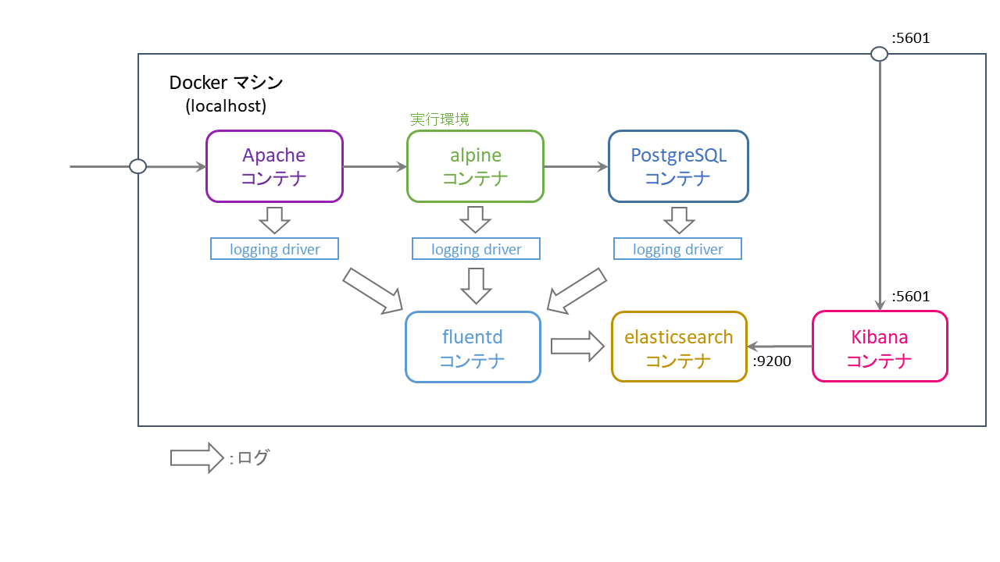

# アプリ名: osake with keycloak

# 概要


# インストール方法
1. Docker または Docker Toolbox をインストール、起動する

1. git リポジトリをクローン、作業フォルダに移動
	```
	$ git clone -b local-dev https://github.com/muroya2355/osake.git
	$ cd osake
	$ ls
	```
	docker-compose.yml があることを確認

1. docker-compose.yml を書き換える
	- windows 以外のOSの場合
		- 文字コードを UTF-8 に変換
		
	- Docker をインストールした場合\
		- "192.168.99.100" 表記を "localhost" に書き換え

	- Docker Toolbox をインストールした場合 \
		→ ` $ docker-machile ls ` で仮想マシンのIPアドレスを確認 \
		→ "192.168.99.100" 表記を "[ IPアドレス ]" に書き換え

1. docker-compose 実行

	Docker イメージをビルド
	
	```
	$ docker-compose build
	$ docker image ls
	```
	osake_osake, osake_osake-dev, osake_postgres, osake_httpd が作成されていることを確認

	Docker コンテナを起動
	
	```
	$ docker-compose up -d
	```
	一回エラーを吐いて終了するので、もう一回 `` $ docker-compose up -d``
	
	その後
	```
	$ docker ps -a
	```
	osake_* イメージに対応する、4つのコンテナが起動 (Up) していることを確認


1. ブラウザからコンテナにアクセス
	* osake アプリケーション

		- Docker をインストールした場合\
		→ http://localhost:10080/

		- Docker Toolbox をインストールした場合 \
		→ ` $ docker-machile ls ` で仮想マシンのIPアドレスを確認（例:192.168.99.100）\
		→ http://192.168.99.100:10080/
	
		- ログインID：a　パスワード：password1 でログインできる

1. コンテナの停止
	
	```
	$ docker-compose -f docker-compose_webapp.yml stop
	$ docker-compose -f docker-compose_logging.yml stop
	```
	を打つとコンテナが停止する。その後

	```
	$ docker-compose -f docker-compose_webapp.yml down
	$ docker-compose -f docker-compose_logging.yml down
	```
	を打つとコンテナが削除される。再び`$ docker-compose up` を打つとコンテナ起動

1. コンテナイメージの削除
	```
	$ docker image rm osake_osake osake_osake-dev osake_postgres osake_httpd ...
	```

# 画面遷移


# 内部設計


# 機能詳細
## 管理者ログイン機能
* ログインに成功した際、セッションクッキー（"auth"）を生成し、ログインIDを登録
* 各ハンドラでクッキーを確認する。
* クッキーが未取得またはログインIDが空文字の時に、ログイン画面にリダイレクトする
* クッキーはブラウザを閉じた際に削除される

## 商品検索／一覧表示機能
* 検索文字列 ⇔ 商品名 から商品を検索し情報を表示


# アーキテクチャ構成

## Web3層

Dockerコンテナを使って ↓ を作成する
* Apache によるリバースプロキシ
* goバイナリ による Webサーバ（開発環境・実行環境）
* postgreSQL による DB サーバ


### Apache

### golang

### PostgreSQL

## ログ分析基盤（作成中）



Dockerコンテナを使って ↓ を作成する
* ログ収集：fluentd
* ログ格納：elasticsearch
* 可視化：Kibana

### fluentd

### elasticsearch

### Kibana

1. FLKのコンテナ起動

	docker-compose_logging.yml に対して同じ操作を実行

	```
	$ docker-compose -f docker-compose_logging.yml build
	$ docker image ls
	$ docker-compose -f docker-compose_logging.yml up -d
	$ docker ps -a
	```

	* Kibana によるログ監視

		- http://localhost:15601/ または http://192.168.199.100:15601/ にアクセスしてログ状況を表示できる